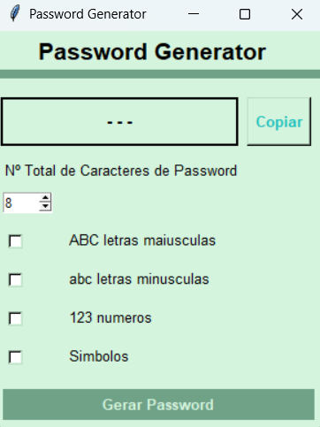

# Python Password Generator (Tkinter)

This is a simple password generator project developed in Python using Tkinter.  
It was created in an **educational context** as part of learning programming and GUI development.

## Features
- Generate passwords with multiple criteria:
  - Length
  - Uppercase and lowercase letters
  - Numbers
  - Special characters
- User-friendly GUI
- Copy to clipboard functionality

## Screenshot

## Technologies
- Python
- Tkinter

## How to Run
1. Open the `password_generator.py` file in your IDE or Python terminal
2. Run the script (`gerador de passwords.py`)
4. The password generator GUI will appear
